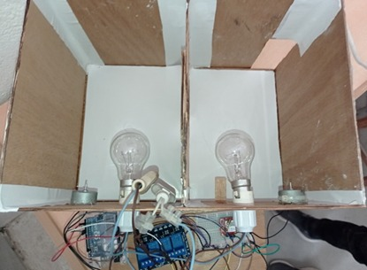

# 📟⚡ Smart-Energy-Meter
This project implements a prototype Smart Energy Meter developed on an Arduino Uno board powered by the ATmega328P microcontroller, designed to provide real-time monitoring and control of household or industrial electrical loads. The prototype focuses on enhancing traditional metering systems by enabling remote data collection, energy consumption analysis, and load status supervision through IoT-based communication.
## 📄 Description
The system integrates the ACS712 current sensor to measure the current drawn by various electrical loads such as 220V lights, fans, and other appliances, ensuring accurate monitoring of individual and total power consumption. The Arduino Uno serves as the central processing unit, handling current measurement, signal processing, and energy usage calculation in real-time.

For communication, the prototype employs the SIM800L GSM/GPRS module, allowing the system to transmit consumption data to a remote user or server via SMS. The system further incorporates load status detection, making it possible to identify active appliances and assist in reducing overall energy consumption through informed decision-making.

## ⚙️ Tools and Technologies

#### 1. Hardware components
- **Microcontroller** : Arduino Uno
- **Sensor** : Analog Infrared Sensor **ACS712**
- **Loads** : fans and light bulbs
- **Communication Module** : GSM **SIM800L**
- **Display** : I²C LCD 16x2
- **Wiring and Connectors** : Used to link all components together
- **Programming** : ArduinoIDE

#### 1.2 Hardware connections
- **ACS712** : 
  - VCC → 5V
  - OUT → 
  - GND → GND
- **SIM800L** :
  - VCC → 5V
  - SDA → 
  - SCL → 
  - GND → GND
- **4 Channel Relay Module** :
  - VCC → 5V
  - IN1 → 
  - IN2 →
  - IN3 → 
  - IN4 → 
  - GND → GND
---
## 🎬 Preview
Here's a preview of the prototype setup of a smart lighting control system using Arduino, relays, and bulbs inside a cardboard test enclosure. This preview shows the hardware wiring and experimental model.

 
 
---
## 📖 Guide to Use
1. Clone this repository:
git clone https://github.com/Ghouilaanas/Smart-Energy-Meter.git
2. 📂 **Open the the Arduino Sketch** : open the Arduino IDE and load the .ino file for this project.
3. ⚙️ **Connect the Components**.
4. 🛠️ **Build and flash the firmware** onto the Arduino Uno board using the Arduino IDE.
5. 🔌 **Connect the sensors, microcontroller, and display** following the wiring diagram for the selected setup.
6. ⚡ **Power on the system** , **monitor the measured values** (current, voltage, and energy consumption) which are shown on the LCD in real time and **send data remotely** through the GSM network.
